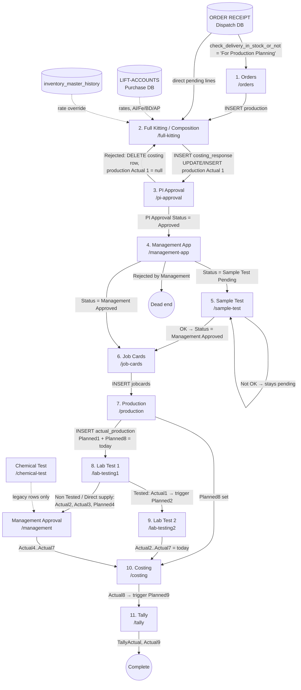
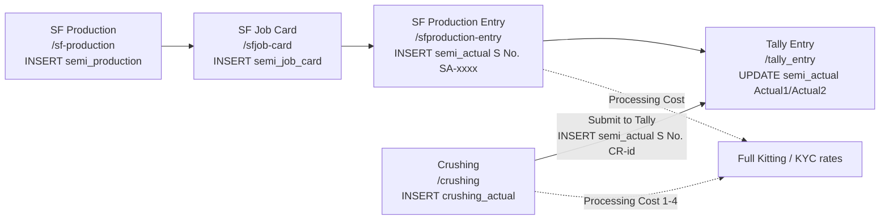

# Production-FMS — Complete System Flow (A to Z)

> Ye document code (`app/`, `lib/`, `components/`) aur **live Supabase DB** (project `Production-FMS`, ref `bliuwvkdtvxmteyzuzds`) dono ko padh kar banaya gaya hai.
> Har stage ke liye likha hai: **kaunsa page**, **data kis table/column se aata hai**, **pending/history ki condition kya hai**, **submit par kaunse columns likhe jaate hain**, aur **next stage kaise trigger hota hai**.
>
> Note: `all_tabels.sql` purana hai — live DB mein bahut saare extra columns hain (COST1–20, PI/Management/Sample fields, `Order Receipt Id`, `Production Id`, `Cancel Qty`, Planned7–9, lab-test columns, etc.). Neeche diya schema **live DB** ka hai.

---

## 0. Index

1. [Architecture — kaunse databases use hote hain](#1-architecture--kaunse-databases-use-hote-hain)
2. [Login & Permissions](#2-login--permissions)
3. [High-level flow diagram](#3-high-level-flow-diagram)
4. [Finished Goods (FG) flow — stage by stage](#4-finished-goods-fg-flow--stage-by-stage)
5. [Semi-Finished (SF) + Crushing flow](#5-semi-finished-sf--crushing-flow)
6. [Support pages (KYC, Settings, Dashboard, Composition QC)](#6-support-pages)
7. [DB Triggers (auto-planning)](#7-db-triggers-auto-planning)
8. [`actual_production` Planned/Actual column map](#8-actual_production-plannedactual-column-map)
9. [Table-wise column dictionary (kaun likhta, kaun padhta)](#9-table-wise-column-dictionary)
10. [Status values, numbering & storage buckets](#10-status-values-numbering--storage-buckets)
11. [Record linking / matching logic](#11-record-linking--matching-logic)
12. [Important observations / gotchas](#12-important-observations--gotchas)

---

## 1. Architecture — kaunse databases use hote hain

App Next.js (client-side) hai, koi backend API nahi — sab pages directly Supabase JS client se read/write karte hain. Clients [lib/supabase.ts](lib/supabase.ts) mein bante hain:

| Client variable | Supabase project | Kya use hota hai | Access |
|---|---|---|---|
| `supabase` | **Production-FMS** (`bliuwvkdtvxmteyzuzds`) | Is system ke saare apne tables | Read + Write |
| `dispatchSupabase` | New-Order-To-Dispatch (`bfgdazpqeyvfxbvglstu`) | Table **`ORDER RECEIPT`** (customer orders) | Read only |
| `purchaseSupabase` | Purchase_FMS (`jcgmyvxcamstnhuwmemc`) | Table **`LIFT-ACCOUNTS`** (raw material purchase rate, Al/Fe/BD/AP %) | Read only |
| `inventorySupabase` | Inventory Management System (`ozrgaddkpixwvcyypqid`) | Table **`inventory_master_history`** (latest item rate) | Read only |
| Google Sheet (gviz) | Sheet ID `1Oh16UfYFmNff0YLxHRh_D3mw3r7m7b9FOvxRpJxCUh4` | Sirf **Dashboard** (`/`) — legacy | Read only |

**Production-FMS ke tables:** `production`, `costing_response`, `jobcards`, `actual_production`, `semi_production`, `semi_job_card`, `semi_actual`, `crushing_actual`, `crushing_items_name` (unused), `kyc`, `master`, `login`, `orders` (unused).

**Storage buckets (Production-FMS):** `sample-tests`, `Semi Finished`, `Crushing`.

---

## 2. Login & Permissions

File: [lib/auth.tsx](lib/auth.tsx), [components/app-sidebar.tsx](components/app-sidebar.tsx), [app/settings/page.tsx](app/settings/page.tsx)

**Table `login`**

| Column | Use |
|---|---|
| `User name` | Login username (`ilike` match — case-insensitive) |
| `Pass` | Password (plain text, `eq` match) |
| `ID` | Unique user id (random string, new user par generate) |
| `Role` | `admin` / `user` — admin ko saare pages + saari firms dikhti hain |
| `Pages` | Comma list `pageid:access` e.g. `orders:full,production:view` (`mark-done` purana naam → `tally_entry`) |
| `Firm` | User ki firm(s), comma-separated e.g. `Pmmpl,Rkl` — har page isi se data filter karta hai |

- Login hone par user `sessionStorage["user"]` mein save hota hai.
- Sidebar mein sirf woh pages dikhte hain jo `Pages` mein hain (admin ko sab).
- **Firm mapping** (`FIRM_MAP`): `Purab → PURAB ORDER`, `Pmmpl → PMMPL ORDER`, `Rkl → RKL ORDER`. Har page `filterDataByFirm` ([lib/matching-utils.ts](lib/matching-utils.ts)) se rows ko user ki firm se filter karta hai (substring match dono taraf).
- **Settings page**: users add/edit/delete karta hai (`login` table), firm dropdown `master."Firm Name"` se aata hai.

---

## 3. High-level flow diagram



Semi-finished flow alag chalta hai (section 5):



---

## 4. Finished Goods (FG) flow — stage by stage

### Stage 1 — Orders  (`/orders`)
File: [app/orders/page.tsx](app/orders/page.tsx)

**READ**
- `dispatchSupabase."ORDER RECEIPT"` where `check_delivery_in_stock_or_not = 'For Production Planning'`
  - Columns: `id`, `Timestamp`, `DO-Delivery Order No.`, `Firm Name`, `Party Names`, `Product Name`, `Quantity`, `Rate Of Material`, `Expected Delivery Date`, `GP%`, `Specific Concern`, `Crm For The Customer`, `Qty Transferred`, `Delivered`, `In Stock Or Not`, `Pending Qty`, `Complete Date`
- `production` (`*`) — match by `Delivery Order No.` + `Product Name` + `Firm Name` (lowercase trim) taaki status dikhe.

**Screen par columns ka source**

| Screen field | Source |
|---|---|
| ID | `ORDER RECEIPT.id` |
| DO No. / Firm / Party / Product / Qty | `ORDER RECEIPT` (`DO-Delivery Order No.`, `Firm Name`, `Party Names`, `Product Name`, `Quantity`) |
| Exp. Delivery | `ORDER RECEIPT.Expected Delivery Date` |
| Priority | `production.Priority` |
| Status | `production.Order Cancel` → Cancelled; `production.Status` in (completed/complete/done) → Completed; else Pending |
| Qty Del. / Prod Pend. | `ORDER RECEIPT.Delivered` / `ORDER RECEIPT.Pending Qty` |
| Selling Price | `ORDER RECEIPT.Rate Of Material` |
| Notes / CRM | `ORDER RECEIPT.Specific Concern` / `Crm For The Customer` |

**WRITE**
- "Create" form → **INSERT `production`** (ek DO ke har product ki ek row, jo already production mein nahi hai):
  `Delivery Order No.`, `Firm Name`, `Party Name`, `Product Name`, `Order Quantity` (= ORDER RECEIPT Quantity), `Expected Delivery Date`, `Priority` (Normal/Urgent), `Note`, `Status = 'pending'`, `product_rate` (= Rate Of Material).
  - Trigger `trg_set_planned1` → `production."Planned 1" = current_date`.
- "Cancel" → **UPDATE `production`**: `Order Cancel = true`, `Reason = 'Qty: <x> - <reason>'`.

> Orders page optional hai — Full Kitting directly `ORDER RECEIPT` se bhi pending lines utha leta hai (Stage 2).

---

### Stage 2 — Full Kitting / Composition by Lab  (`/full-kitting`)
File: [app/full-kitting/full-kitting-content.tsx](app/full-kitting/full-kitting-content.tsx)

**READ (10 sources ek saath)**
1. `dispatchSupabase."ORDER RECEIPT"` (For Production Planning)
2. `purchaseSupabase."LIFT-ACCOUNTS"` (order Timestamp desc)
3. `costing_response` (order id desc)
4. `production`
5. `semi_actual`, 6. `crushing_actual`, 7. `semi_job_card`, 8. `semi_production` (processing cost + firm tracing)
9. `kyc`
10. `inventorySupabase.inventory_master_history` (order snapshot_date desc)
+ browser `localStorage["custom_kyc_products"]`

**PENDING list kaise banti hai** (do sources):
- **(a) `production` rows** jahan `Actual 1` null, `Order Cancel` false, aur us `DO + Party + Product` ki composition `costing_response` mein nahi hai.
- **(b) `ORDER RECEIPT` lines** jinki koi composition nahi hai aur koi matching production row bhi nahi:
  - Agar `costing_response."Order Receipt Id"` = line ka `id` → done (skip).
  - Warna DO+Party+Product ke liye jitni compositions hain utni lines "consume" hoti hain, baaki pending rehti hain (split-quantity orders ke liye).
  - Legacy compositions bina party ke → DO+Product match.

**HISTORY** = saari `costing_response` rows (cancelled bhi).

**Raw-material master (KYC products) — rate/Al/Fe/BD/AP kahan se aata hai** (priority order, key = `firm___product`):
1. `LIFT-ACCOUNTS` (latest receipt per firm+material, sorted by `Date Of Receiving` / `ACTUAL RECEIPT DATE` / `Date Of Bill` / `Timestamp`):
   - `alumina ← Alumina Percent Age %`, `iron ← Iron Percent Age %`, `bd ← BD Percent Age %`, `ap ← AP Percent Age %`
   - `price = Rate + Transporting Rate` (agar transport 0 hai aur `Type Of Transporting Rate = fixed` → `Transporter Rate / (Lifting Qty | Total Bill Quantity | Actual Quantity | Qty)`)
2. `crushing_actual` → `Finished Goods Name 1..4` (grains): parent material ka rate + `Processing Cost i`, Al/Fe/BD/AP parent se.
3. `semi_actual` → `Product Name` (fines etc.): matching grain/parent ka rate + `Processing Cost`. Firm trace: `semi_actual → semi_job_card (SJC-Sr No.) → semi_production (SF-Sr No.).Firm name`.
4. `kyc` table (`Product name`, `Firm Name`, `Alumina`, `Iron`, `Bd`, `Ap`, `Price`) — sirf agar upar nahi mila.
5. `localStorage custom_kyc_products`.
6. **Final override:** agar `inventory_master_history` (`firm_name`, `item_name`, `product_rate`) mein rate > 0 hai to **price wahi** use hota hai.

**Form calculation** (har row: material + %):
- `al = baseAlumina × % / 100`, same for fe/bd/ap, `cost = basePrice × % / 100`
- Totals: `variableCost = Σ cost`; display mein `alNormalized = Σal / Σ% × 100` (Purab/RKL ke liye Fe bhi normalized)
- `Manufacturing Cost` default: **PMMPL = 1500, RKL/Purab = 2000** (editable)
- `SELLING PRICE = variableCost + Manufacturing Cost`

**WRITE — Save**
1. **INSERT `costing_response`**:
   - `Composition No.` = client side `CN-###` (last 100 rows ka max + 1; trigger bhi backup mein bharta hai)
   - `Order No.` ← DO, `product name`, `Firm Name`, `Party Name`, `Order Receipt Id` ← ORDER RECEIPT `id` (agar line wahan se aayi)
   - `alumina`, `iron`, `BD`, `AP` (totals, non-normalized), `VARIABLE COST`, `Manufacturing Cost`, `SELLING PRICE`
   - `RM1..RM20` (material name), `QTY1..QTY20` (**percentage**), `COST1..COST20` (row cost)
   - `Expected WC %`, `Expected Sticky Flow`, `Expected IST`, `Expected FST`, `Expected BD 110C`, `Expected BD 1100C`, `Expected CCS 110C`, `Expected CCS 1100C`, `Expected PLC 1100C`
   - Trigger: `Planned 1 = current_date`
2. **UPDATE `production` (by id) ya INSERT** (agar production row nahi thi):
   `Delivery Order No.`, `Firm Name`, `Party Name`, `Product Name`, `Order Quantity`, `Expected Delivery Date`, `Priority`, `Note`, `Crm Name`, `Quantity Delivered`, `Production Pending`, `Status`, `Planned 1`, **`Actual 1 = today`**, `product_rate`, `Upload SO`, `Order Receipt Id`.

**WRITE — Cancel order**
- `production.Order Cancel = true` (agar production row hai)
- INSERT `costing_response` with `Status = 'Cancelled'`, `Remarks`, saare numbers 0, RM/QTY/COST null.

---

### Stage 3 — PI Approval  (`/pi-approval`)
File: [app/pi-approval/page.tsx](app/pi-approval/page.tsx)

**READ**: `kyc` (RM ke Al/Fe/BD/AP dikhane ke liye, key = `Product name`), `production` (`id, Delivery Order No., Product Name, product_rate, Firm Name, Party Name, Order Quantity, Order Receipt Id`), `costing_response` (`*`).

- Production match: pehle `costing_response.Order Receipt Id = production.Order Receipt Id`, warna DO+Product, warna DO.
- **Pending** = `PI Approval Status` khaali. **History** = `PI Approval Status` bhara.

**Calculation (dialog)**:
- `rate = production.product_rate` (fallback `SELLING PRICE`)
- `totalCost = Σ COSTi + Manufacturing Cost`, `profit = rate − totalCost`, `GP% = profit / rate × 100`
- Mfg Cost ya GP% edit karo to dusra auto-calc hota hai.

**WRITE**
- **Approved** → UPDATE `costing_response`: `PI Approval Status = 'Approved'`, `PI Remarks`, `PI Approved At = now`, `GP %AGE Actual`, `Manufacturing Cost`, `Material Cost Actual` (= totalCost), `Status = 'PI Approved'`.
- **Rejected** → **DELETE** `costing_response` row; UPDATE `production` (by `Delivery Order No.` + `Product Name`): `Actual 1 = null`, `Status = 'Rejected – Redo Composition'` → order wapas Full Kitting pending mein.

---

### Stage 4 — Management App (Composition approval)  (`/management-app`)
File: [app/management-app/page.tsx](app/management-app/page.tsx)

**READ**: `kyc`, `production` (same select as PI), `costing_response` where **`PI Approval Status = 'Approved'`**.
- **Pending** = `Management Approval Status` khaali; **History** = bhara.
- Dialog: `totalCost = Material Cost Actual` (warna Σ COSTi), `GP = GP %AGE Actual` (warna calc), `rate = production.product_rate`.

**WRITE** → UPDATE `costing_response`:
- Common: `Management Approval Status` (Approved/Rejected), `Management Remarks`, `Management Approved At`, `GP %AGE Actual`, `Material Cost Actual`
- Approved + type **"OK"** → `Status = 'Management Approved'`, `Management Approval Type = 'OK'` → **Job Cards** mein jaata hai
- Approved + type **"Make a sample Test"** → `Status = 'Sample Test Pending'`, `Management Approval Type = 'Make a sample Test'` → **Sample Test**
- Rejected → `Status = 'Rejected by Management'`, `Management Approval Type = null` (koi aage ka stage nahi)

---

### Stage 5 — Sample Test  (`/sample-test`)
File: [app/sample-test/page.tsx](app/sample-test/page.tsx)

**READ**: `costing_response` where `Status IN ('Sample Test Pending','Management Approved')`, `production` (party/qty ke liye).
- **Pending** = `Status = 'Sample Test Pending'`
- **History** = `Status = 'Management Approved'` AND `Management Approval Type = 'Make a sample Test'`

**WRITE**
- Image upload → bucket **`sample-tests`**, path `samples/<CompositionNo>_<ts>.<ext>` → public URL
- UPDATE `costing_response`: `Sample Test Status` (OK/Not OK), `Sample Test Remarks`, `Sample Test Image URL`, `Sample Test Completed At`
  - OK → `Status = 'Management Approved'` (→ Job Cards)
  - Not OK → `Status = 'Sample Test Pending'` (wahi pending rehta hai)

---

### Stage 6 — Job Cards  (`/job-cards`)
File: [app/job-cards/page.tsx](app/job-cards/page.tsx)

**READ**: `production`, `jobcards`, `master`, `costing_response`.

**Pending (orders jinke job card banne hain)**:
1. `costing_response` rows jahan `Status = 'Management Approved'` AND `Actual 3` khaali
2. Har row ke liye production row: `Order Receipt Id` se, warna `findMatchingRow` (DO+Product+Party → DO+Product → DO → DO numeric)
3. Is order ke job cards: pehle `jobcards.Production Id = production.id`; warna legacy (bina Production Id) DO+Product(+Party) match
4. `totalMade = Σ jobcards.Total Made`, `cancelQty = Σ jobcards.Cancel Qty` (ya cancelled card ka `Quantity − Total Made`)
5. `pending = production.Order Quantity − (totalMade + cancelQty)`
6. Hide agar `production.Order Cancel = true` ya `pending ≤ 0`

| Screen field | Source |
|---|---|
| Order Qty | `production.Order Quantity` |
| Firm / Party / Priority / Exp. Delivery | `production` |
| Rate | `production.product_rate` (fallback `costing_response.SELLING PRICE`) |
| Planned | `costing_response.Planned 2` |
| Supervisor / Shift dropdown | `master.Supervisor Name` / `master.Shift` |

**History** = saare `jobcards` rows.

**WRITE**
- Create → **INSERT `jobcards`**: `JC-Job Card Number` (`JC-###`, **firm-wise** max+1), `Firm Name`, `Supervisor Name`, `Delivery Order No.`, `Party Name`, `Product Name`, `Quantity` (planned qty jo form mein "Total Made" field se aata hai), `Date Of Production`, `Shift`, `Notes`, `Status = 'active'`, `Production Id` (= production.id)
- Cancel job card → UPDATE `jobcards`: `Status = 'cancelled'`, `Notes` (append), `Cancel Qty`, `Cancel Remarks`
- Cancel order (pending tab) → UPDATE `production`: `Order Cancel = true`, `Reason`

---

### Stage 7 — Production  (`/production`)
File: [app/production/page.tsx](app/production/page.tsx)

**READ**: `jobcards`, `kyc`, `actual_production`, `production`, `costing_response` (id desc), `master`.

**Pending (job cards jinki production baaki hai)**:
- `jobcards.Status` cancelled nahi
- `liveTotalMade = Σ actual_production.Quantity Of FG` (same `Job Card No.` + `FIRM Name`, cancelled rows chhod kar); agar koi row nahi to `jobcards.Total Made`
- Pending agar `liveTotalMade < jobcards.Quantity` (Quantity 0 ho to `Time Delay 1` khaali)

**History** = har `actual_production` row (+ cancelled job cards jinka koi production nahi).

**Material dropdown**: `master.Name Of Raw Material` + `kyc.Product name`. Price map: `kyc.Price`.

**WRITE — Production entry submit**
1. `Serial Number` = last `actual_production` row ka Serial Number + 1
2. Cost calc (composition = `costing_response` match by DO+product):
   - `expected_cost = Σ FGqty × QTYi% × kyc.Price`
   - `actual_cost = Σ entered RM qty × kyc.Price`
   - `manufacturing_cost_used = Manufacturing Cost × FGqty`
   - `selling_price_total = production.product_rate × FGqty`
   - `expected_profit`, `actual_profit`, `profit_variance`
3. **INSERT `actual_production`**: `Timestamp`, `Job Card No.`, `FIRM Name`, `Date Of Production`, `Name Of Supervisor`, `Product Name`, `Quantity Of FG`, `Party Name`, `Serial Number`, `Machine Running hour`, `Remarks1`, `Order No.` (= DO), **`Planned1 = today`** (→ Lab Test 1), **`Planned8 = today`** (→ Costing, parallel), cost fields upar wale, `Raw Material Name 1..20`, `Quantity Of Raw Material 1..20`
4. **UPDATE `jobcards`** (by id): `Total Made = old + FG`; agar fully produced → `Actual 1 = now`, `Planned 2 = today`, `Time Delay 1 = 1` (warna null)
5. **UPDATE `production`** (DO + product match): `Actual Production Done += FG`

**Other writes**: Admin raw-material edit → UPDATE `actual_production` RM 1..20; Cancel JC → `jobcards` (`Status`, `Notes`, `Cancel Qty`, `Cancel Remarks`).

Production page ka **RM Summary** tab history se date/product/material wise consumption nikalta hai (Excel export).

---

### Stage 8 — Lab Test 1  (`/lab-testing1`)
File: [app/lab-testing1/page.tsx](app/lab-testing1/page.tsx)

**READ**: `jobcards`, `master`, `production`, `actual_production`, `costing_response`.
- **Pending** = `actual_production` jahan `Job Card No.` hai, **`Planned1` set**, **`Actual1` khaali** (job card partially cancelled ho tab bhi dikhega)
- **History** = `Actual1` set
- Composition info (`GP %AGE`, `alumina`, `iron`, `BD`, `AP`, `RM1`, `Alumina Percentage %`, `Iron Percentage %`) `costing_response` se DO+product match
- Dropdowns: `master.Flow Of Material`, `master.Test Status` (+Tested / Non Tested / Direct supply), `master.Tested by`

**WRITE** → UPDATE `actual_production` (by id):
- Hamesha: `Actual1 = now`, `Status2 = <status>`
- **Tested**: `DateOfTest1`, `WCPercentage`, `TestedBy1`, `InitialSettingTime`, `FlowOfMaterial`, `FinalSettingTime`, `WhatToBeMixed`, `SieveAnalysis`, `LabTest1Remarks = null`
  → trigger: `Planned2 = Actual1` → **Lab Test 2 pending**
- **Non Tested / Direct supply**: test fields null, `LabTest1Remarks`, aur **`Actual2 = Planned3 = Actual3 = Planned4 = today`** (Lab Test 2 + Chemical skip) → **Management Approval (`/management`) pending**; agar `Planned8` null hai to `Planned8 = today`

---

### Stage 9 — Lab Test 2  (`/lab-testing2`)
File: [app/lab-testing2/page.tsx](app/lab-testing2/page.tsx)

**READ**: same 5 tables.
- **Pending** = `Actual1` set AND `Status3` khaali, aur (Status2 Non Tested/Direct supply + Actual2 set) wale exclude
- **History** = `Status3` set

**WRITE** → UPDATE `actual_production`:
- `Actual2 = now`, `Status3`, aur **`Actual3 = Actual4 = Actual5 = Actual6 = Actual7 = today`** (Chemical Test + saare checks + Management skip)
- Tested: `TestedBy2`, `DateOfTest2`, `BDAt110C`, `CCSAt100C`, `BDAt1100C`, `CCSAt1100C`, `PLCAt1100C`, `Remarks2 = null`
- Non Tested: woh fields null, `Remarks2 = remarks`
- Trigger: `Planned3 = Actual2`, `Planned4..7` fill, `Planned8` (agar null) — costing pehle se Planned8 set hone se open hai

---

### Stage 9b — Chemical Test  (`/chemical-test`)
File: [app/chemical-test/page.tsx](app/chemical-test/page.tsx)

- **Pending** = `actual_production.Planned3` set AND `Actual3` khaali (job card cancelled ho to hide)
- **History** = `Actual3` set
- **WRITE**: `Actual3 = now`, `ChemicalStatus`, Tested → `TestedBy3`, `AluminaPct`, `IronPct`, `SilicaPct`, `CalciumPct`, `Remarks3 = null`; Non Tested → fields null, `Remarks3`
- Trigger: `Planned4 = Actual3` → Management Approval

> ⚠️ Current flow mein Lab Test 2 hi `Actual3` bhar deta hai, aur Lab Test 1 skip path bhi `Actual3` bhar deta hai — isliye **naye records Chemical Test mein kabhi pending nahi aate**. Ye page ab sirf purane/legacy rows ke liye hai.

---

### Stage 9c — Management Approval / Check  (`/management`, `/check` → redirect)
File: [app/management/page.tsx](app/management/page.tsx) (sidebar mein link nahi hai, URL se khulta hai)

- **READ**: `actual_production`, `jobcards` (purane lab data fallback ke liye: `Status 2`, `Date Of Test 1`, `WC Percentage %`, ... `Alumina %`, `Tested By 3` etc.)
- **Pending** = koi bhi pair `Planned4/Actual4`, `Planned5/Actual5`, `Planned6/Actual6`, `Planned7/Actual7` mein Planned set aur Actual khaali
- **History** = Actual4..7 mein se koi set
- **WRITE**: `Actual4 = Actual5 = Actual6 = now`, `Actual7 = today`, `Remarks2 = remarks` → trigger `Planned8` (agar null)

> Practically yahan sirf Lab Test 1 ke **Non Tested / Direct supply** wale records aate hain.

---

### Stage 10 — Costing  (`/costing`)
File: [app/costing/page.tsx](app/costing/page.tsx)

**READ**: `actual_production`, `jobcards`, `costing_response`, `dispatchSupabase."ORDER RECEIPT"` (`DO-Delivery Order No.`, `Rate Of Material`, `Product Name`, `Firm Name`), `purchaseSupabase."LIFT-ACCOUNTS"`, `inventorySupabase.inventory_master_history`.
- **Pending** = `Job Card No.` set, **`Planned8` set**, `Actual8` khaali (Planned8 production ke time hi set ho jata hai → costing Lab Test ke saath parallel)
- **History** = `Planned8` aur `Actual8` dono set; RM rate priority: `costing_response.COSTi` → LIFT-ACCOUNTS (`Rate + Transporting Rate`) → inventory `product_rate`
- Selling rate map `ORDER RECEIPT.Rate Of Material` se (DO+Product+Firm → DO+Product → DO+Firm → DO)

**Dialog calculation** (Costing button):
- Har RM ke liye live query `LIFT-ACCOUNTS` (`ilike Firm Name`, `ilike Raw Material Name`, latest): `Rate`, `Type Of Transporting Rate`, `Transporter Rate`, `Lifting Qty`, `Total Bags Qty`
  - transportRate = `Transporter Rate / Lifting Qty` (per mt / fixed)
  - PP bag special (`PP BAG (25 KGS)` etc.): `rate = Lifting Qty × Rate / Total Bags Qty`
- `totalMaterialCost = Σ qty × (rate + transportRate)`
- `perMtCost = totalMaterialCost / Quantity Of FG`
- `Manufacturing Cost` = `costing_response.Manufacturing Cost` (warna PMMPL 1500 / RKL-Purab 2000)
- **Costing Amount = perMtCost + Manufacturing Cost** (editable)

**WRITE** → UPDATE `actual_production`: `Actual8 = today`, `Costing Amount` → trigger **`Planned9 = Actual8`** → Tally.

---

### Stage 11 — Tally  (`/tally`)
File: [app/tally/page.tsx](app/tally/page.tsx)

- **READ**: `actual_production` (`*`)
- **Pending** = `Job Card No.` set, **`Planned9` set**, `TallyActual` khaali
- **History** = `TallyActual` set
- **WRITE** → UPDATE `actual_production`: `TallyActual = now`, `TallyRemarks`, `Actual9 = today` → **FG flow complete**

---

## 5. Semi-Finished (SF) + Crushing flow

Helper: [lib/semi-finished-supabase.ts](lib/semi-finished-supabase.ts) (`fetchSemiProductionRows`, `fetchSemiJobCardRows`, `fetchSemiActualRows`, `fetchMasterRows`)

### SF-1 — SF Production (order)  (`/sf-production`)
File: [app/sf-production/page.tsx](app/sf-production/page.tsx)
- **READ**: `semi_production`, `semi_job_card`, `master` (`Name Of Raw Material` → product list, `Firm Name` → firm list)
- Live `Total Made = Σ semi_job_card.Actual Made` (same `SF-Sr No.` + product); `Pending = Qty − TotalMade − Cancel Order`
- **WRITE — create**: INSERT `semi_production`: `Timestamp`, `SF-Sr No.` (`SF-<max+1>`), `Name Of Semi Finished Good`, `Qty`, `Notes`, `Total Planned = 0`, `Total Made = 0`, `Pending = Qty`, `Cancel Order = 0`, `Status = ''`, `Planned = today`, `Firm name`
- **WRITE — cancel**: UPDATE `semi_production`: `Pending`, `Cancel Order = cancelQty`, `Status = ''`, `Reason`; agar pending 0 → `semi_job_card.Status = 'cancelled'` (jinka `Actual` null)

### SF-2 — SF Job Card Planning  (`/sfjob-card`)
File: [app/sfjob-card/page.tsx](app/sfjob-card/page.tsx)
- **READ**: `semi_job_card`, `master` (`SF Supervisor Name`), `semi_actual`, `semi_production`
- **Pending** = `semi_production` jahan pending > 0, status complete/cancelled nahi, `Planned` set, `Actual` khaali
- **WRITE**: INSERT `semi_job_card`: `SJC-Sr No.` (`SJC-<max+1>`, start 381), `Semi Finished Production No.` (= SF-Sr No.), `Supervisor Name`, `Product Name`, `Qty`, `Date Of Production`, `Actual Made = 0`, `Pending = Qty`, `Status = ''`, `Planned = today`
  - UPDATE `semi_production`: `Total Planned += qty`, `Pending = Qty − TotalPlanned − Cancel`, `Planned = today`, `Status = COMPLETED/PENDING`

### SF-3 — SF Production Entry  (`/sfproduction-entry`)
File: [app/sfproduction-entry/page.tsx](app/sfproduction-entry/page.tsx)
- **READ**: `semi_job_card`, `semi_actual`, `master` (`Name Of Raw Material`), `semi_production` (firm)
- **Pending** = SJC jinka status complete/cancelled nahi, parent cancelled nahi, `Planned` set, `Actual` khaali
- **WRITE**:
  - Photos → bucket **`Semi Finished`**, folder `Semi Finished Images/`
  - INSERT `semi_actual`: `Semi Finished Job Card No.`, `Supervisor Name`, `Date Of Production`, `Product Name`, `Qty Of Semi Finished Good`, `Processing Cost`, `Raw Material Name 1..5` / `Quantity Of Raw Material 1..5`, `Is Any End Product`, `End Product Name`, `End Product Qty`, `S No.` (`SA-<max+1>`, start 1001), `Starting/Ending Reading` (+ Photo), `Machine Running hour` / `Machine Running` (= ending − starting ya manual), `Semi Finished Production No.`, `Planned1 = today`
  - UPDATE `semi_job_card`: `Actual Made += qty`, `Pending`, `Actual` (=today agar pending 0), `Status = COMPLETED/PENDING`
  - UPDATE `semi_production`: `Total Made += qty`
- Admin: `semi_actual.Processing Cost` edit; SJC cancel → `Status = 'CANCELLED'`, `Cancel Remarks`

### SF-4 — Crushing  (`/crushing`)
File: [app/crushing/page.tsx](app/crushing/page.tsx)
- **READ**: `crushing_actual`, `master` (`Crushing Product Name`, `Finished Goods Name`), `semi_actual` (`S No.` like `CR-%` → kaun submit ho chuka)
- **WRITE — entry**: photos → bucket **`Crushing`**; INSERT `crushing_actual`: `Date Of Production`, `Crushing Product Name`, `Qty Of Crushing Product`, `Finished Goods Name 1..4`, `Qty 1..4`, `Processing Cost 1..4`, `Starting/Ending Reading Photo`, `Remarks`, `Machine Running Hour`, `Firm Name` (admin chunega, warna user.firm)
- Edit cost → UPDATE `crushing_actual."Processing Cost i"`
- **Submit to Tally** → INSERT `semi_actual` with `S No. = 'CR-<crushing id>'`, `Semi Finished Job Card No. = 'CR-<id>'`, `Product Name = Crushing Product Name`, `Qty Of Semi Finished Good = input qty`, **`Raw Material Name 1..4 = Finished Goods 1..4`** (output ko RM columns mein rakha jaata hai), `Planned1 = Date Of Production`, **`Semi Finished Production No. = Firm Name`** (firm yahan store hota hai)

### SF-5 — Tally Entry  (`/tally_entry`)
File: [app/tally_entry/page.tsx](app/tally_entry/page.tsx)
- **READ**: `semi_actual` (sirf `S No.` `SA-` ya `CR-`), `semi_production` (firm). CR rows ke liye firm = `Semi Finished Production No.`
- **Pending** = `Actual2` khaali; **History** = `Actual2` set
- **WRITE** → UPDATE `semi_actual`: `Actual1 = Planned2 = Actual2 = today`, `Status = Status1 = remarks`

---

## 6. Support pages

### KYC  (`/kyc`) — [components/KycProductTable.tsx](components/KycProductTable.tsx)
- Full Kitting jaisa hi product-rate master banata hai: `LIFT-ACCOUNTS` (Purchase DB) + `semi_actual` + `crushing_actual` + `semi_job_card` + `semi_production` + `inventory_master_history`, deduplicated per Firm+Product (latest).
- `LIFT-ACCOUNTS` par realtime listener (`realtime-kyc-products` channel).
- **Add custom product** → `localStorage["custom_kyc_products"]` + INSERT `kyc` (`Product name`, `Firm Name = '<FIRM> ORDER'`, `Alumina`, `Iron`, `Bd`, `Ap`, `Price = base + transport`) + INSERT `custom_kyc_products`.
- **Delete** → localStorage se hata + DELETE `kyc` where `Product name ilike <name>`.

### Composition QC  (`/composition-qc`) — read-only report
File: [app/composition-qc/page.tsx](app/composition-qc/page.tsx)
- **READ**: `jobcards` (`Time Delay 1` not null = fully produced), `actual_production`, `production`, `costing_response`, `kyc` (`Price`), `ORDER RECEIPT` (sirf `For Production Planning` wale).
- Har job card: composition (`RMi`, `QTYi%`) vs actual (`Raw Material Name i` / `Quantity Of Raw Material i`):
  - `expectedQty = QTYi% × Quantity Of FG`, `expectedCost = expectedQty × kyc.Price`, `actualCost = actualQty × kyc.Price`
  - extra materials (composition mein nahi) alag flag
  - `sellingPriceTotal = product_rate × FG`, `mfgTotal = Manufacturing Cost × FG`, expected/actual profit, variance
- Kuch bhi write nahi karta.

### Settings  (`/settings`)
- `login` table CRUD (via `lib/auth.tsx`), firm list `master."Firm Name"` se.

### Dashboard  (`/`) — [app/page.tsx](app/page.tsx)
- ⚠️ **Supabase se nahi**, purani **Google Sheet** (gviz) se data padhta hai: sheets `Orders`, `Production`, `Master`, `Costing Response`, `JobCards`, `Actual Production`, `Semi Production`, `Crushing Actual` — column **index** (`col0`, `col1`…) se map hota hai. Agar sheet ab update nahi hoti to dashboard numbers stale honge.

---

## 7. DB Triggers (auto-planning)

Live DB mein ye triggers active hain (verify kiya gaya):

| Table | Trigger | Function | Kaam |
|---|---|---|---|
| `production` | `trg_set_planned1` (BEFORE INSERT) | `set_planned1_date` | `Planned 1` null ho to `current_date` |
| `costing_response` | `trg_set_planned1` (BEFORE INSERT) | `set_planned1_date` | `Planned 1 = current_date` |
| `costing_response` | `trg_set_planned2` (BEFORE INSERT/UPDATE) | `set_planned2_from_actual2` | `Actual 2` set & `Planned 2` null → `Planned 2 = Actual 2` |
| `costing_response` | `trg_set_composition_no` (BEFORE INSERT) | `set_new_composition_no` | `Composition No.` khaali ho to `CN-###` |
| `actual_production` | `trg_auto_plan_actual_production` (BEFORE INSERT/UPDATE) | `auto_plan_actual_production` | Chain neeche dekho |

`auto_plan_actual_production` (live version = [restructure_pipeline.sql](restructure_pipeline.sql); [db_auto_planning_actual_production.sql](db_auto_planning_actual_production.sql) purana hai, use mat karo):

```
Planned1 null          → Planned1 = current_date
Actual1 set            → Planned2 = Actual1
Actual2 set            → Planned3 = Actual2
Actual3 set            → Planned4 = Actual3
Actual4 set            → Planned5 = Actual4
Actual5 set            → Planned6 = Actual5
Actual6 set            → Planned7 = Actual6
Actual7 set            → Planned8 = Actual7
Actual8 set            → Planned9 = Actual8
```
(Har step tabhi jab target Planned column null ho.)

---

## 8. `actual_production` Planned/Actual column map

| Stage | Planned (kisne set kiya) | Actual (kisne set kiya) | Page |
|---|---|---|---|
| Lab Test 1 | `Planned1` — Production insert (+trigger) | `Actual1` — Lab Test 1 | /lab-testing1 |
| Lab Test 2 | `Planned2` — trigger (Actual1) | `Actual2` — Lab Test 2 (ya LT1 skip) | /lab-testing2 |
| Chemical Test | `Planned3` — trigger / LT1 skip | `Actual3` — Chemical / LT2 / LT1 skip | /chemical-test |
| Check (Devshree) | `Planned4` — trigger / LT1 skip | `Actual4` — Management / LT2 | /management |
| Check (Anand) | `Planned5` — trigger | `Actual5` — Management / LT2 | /management |
| Check (Jitendra) | `Planned6` — trigger | `Actual6` — Management / LT2 | /management |
| Management Approval | `Planned7` — trigger | `Actual7` — Management / LT2 | /management |
| Costing | `Planned8` — **Production insert** (+trigger) | `Actual8` + `Costing Amount` — Costing | /costing |
| Tally | `Planned9` — trigger (Actual8) | `Actual9` + `TallyActual` + `TallyRemarks` — Tally | /tally |

Lab test result columns: LT1 → `Status2`, `DateOfTest1`, `WCPercentage`, `TestedBy1`, `InitialSettingTime`, `FlowOfMaterial`, `FinalSettingTime`, `WhatToBeMixed`, `SieveAnalysis`, `LabTest1Remarks`. LT2 → `Status3`, `TestedBy2`, `DateOfTest2`, `BDAt110C`, `CCSAt100C`, `BDAt1100C`, `CCSAt1100C`, `PLCAt1100C`, `Remarks2`. Chemical → `ChemicalStatus`, `TestedBy3`, `AluminaPct`, `IronPct`, `SilicaPct`, `CalciumPct`, `Remarks3`.

**Real-life path (abhi ka code):**
- **Tested route:** Production → LT1 (Tested) → LT2 (Actual2..7 ek saath) → Costing → Tally
- **Skip route:** Production → LT1 (Non Tested / Direct supply) → Management Approval → Costing → Tally
- Costing hamesha production ke din se hi open hai (Planned8), lab ke saath parallel.

---

## 9. Table-wise column dictionary

### `production` (order-line master)
| Column | Written by | Read by |
|---|---|---|
| `Delivery Order No.`, `Firm Name`, `Party Name`, `Product Name` | Orders (insert), Full Kitting (insert/update) | Sab FG pages (matching key) |
| `Order Quantity` | Orders, Full Kitting | Job Cards (pending calc), PI/Mgmt/Sample (display) |
| `Expected Delivery Date`, `Priority`, `Note`, `Crm Name` | Orders, Full Kitting | Job Cards, Production, Labs |
| `Order Cancel`, `Reason` | Orders, Full Kitting, Job Cards (cancel) | Orders, Full Kitting, Job Cards |
| `Status` | Orders (`pending`), Full Kitting, PI reject (`Rejected – Redo Composition`) | Orders, Full Kitting |
| `Planned 1` | Trigger / Full Kitting | Full Kitting |
| `Actual 1` | Full Kitting (composition done), PI reject (null) | Full Kitting (pending filter) |
| `Actual Production Done` | Production (+= FG) | — |
| `Quantity Delivered`, `Production Pending` | Full Kitting (copy from ORDER RECEIPT) | — |
| `product_rate` | Orders, Full Kitting (= ORDER RECEIPT Rate Of Material) | PI, Mgmt App, Job Cards, Production, Composition QC |
| `Upload SO` | Full Kitting | Full Kitting |
| `Order Receipt Id` | Full Kitting | PI, Mgmt App, Sample, Job Cards, Composition QC (exact linking) |
| `Actual Production Planned`, `Stock Transfered`, `Quantity In Stock`, `Planning Pending`, `Date Of Complete Planning`, `Planned2`, `Actual2`, `Delay 1/2` | — (unused by current code) | Orders (display only some) |

### `costing_response` (composition + approvals)
| Column | Written by | Read by |
|---|---|---|
| `Composition No.` | Full Kitting / trigger | Sab approval pages |
| `Order No.`, `product name`, `Firm Name`, `Party Name`, `Order Receipt Id` | Full Kitting | Matching everywhere |
| `RM1..20`, `QTY1..20` (%), `COST1..20` | Full Kitting | PI, Mgmt App, Sample, Production (expected cost), Composition QC, Costing |
| `alumina`, `iron`, `BD`, `AP` | Full Kitting | PI, Mgmt App, Lab Test 1 |
| `VARIABLE COST`, `Manufacturing Cost`, `SELLING PRICE` | Full Kitting (Mfg Cost: PI bhi) | PI, Production, Composition QC, Costing |
| `Expected WC %` … `Expected PLC 1100C` | Full Kitting | PI, Mgmt App |
| `PI Approval Status`, `PI Remarks`, `PI Approved At` | PI Approval | PI, Mgmt App (filter) |
| `GP %AGE Actual`, `Material Cost Actual` | PI, Mgmt App | PI, Mgmt App |
| `Management Approval Status/Remarks/Approved At/Type` | Mgmt App | Mgmt App, Sample |
| `Sample Test Status/Remarks/Image URL/Completed At` | Sample Test | Sample Test |
| `Status` | Full Kitting (Cancelled), PI (`PI Approved`), Mgmt App, Sample | Job Cards (`Management Approved`), Sample |
| `Planned 1` | Trigger | Lab Test 1 (display) |
| `Planned 2`, `Actual 3`, `Planned 4` | (trigger / koi nahi) | Job Cards, Chemical Test (display) |
| `GP %AGE`, `Interest (days)`, `Interest Cost`, `Transporting (FOR)`, `Alumina Percentage %`, `Iron Percentage %`, `Actual 2`, `Time Delay 1` | — (legacy, code nahi likhta) | Display only |

### `jobcards`
| Column | Written by | Read by |
|---|---|---|
| `JC-Job Card Number`, `Firm Name`, `Supervisor Name`, `Delivery Order No.`, `Party Name`, `Product Name`, `Quantity`, `Date Of Production`, `Shift`, `Notes`, `Status`, `Production Id` | Job Cards (insert) | Production, Labs, Costing, Composition QC |
| `Total Made` | Production (+= FG) | Job Cards, Production |
| `Actual 1`, `Planned 2`, `Time Delay 1` | Production (fully produced) | Production, Composition QC (`Time Delay 1` not null) |
| `Cancel Qty`, `Cancel Remarks` | Job Cards, Production (cancel) | Job Cards, Production |
| `Status 2..4`, lab columns (`WC Percentage %`, `BD At 110C`, `Alumina %`…) | — (legacy) | Management page fallback only |

### `actual_production`
Section 8 dekho. Baaki: `Job Card No.`, `FIRM Name`, `Order No.`, `Party Name`, `Product Name`, `Quantity Of FG`, `Serial Number`, `Name Of Supervisor`, `Date Of Production`, `Machine Running hour`, `Remarks1`, `Raw Material Name/Quantity 1..20`, `expected_cost`, `actual_cost`, `manufacturing_cost_used`, `selling_price_total`, `expected_profit`, `actual_profit`, `profit_variance` — sab **Production** page insert karta hai. `PP BAG USED`, `PP BAG TO BE USED`, `PP Bag (Small)`, `Color Condition`, `Status`, `Qty`, `Remarks`, `Time Delay1..3`, `SerialNumber` — code nahi likhta (legacy, Tally page sirf display).

### `semi_production` / `semi_job_card` / `semi_actual` / `crushing_actual`
Section 5 mein har column ka writer diya hai.

### `kyc`
`Product name`, `Firm Name`, `Alumina`, `Iron`, `Bd`, `Ap`, `Price` — KYC page (custom product) likhta hai. Padhte hain: Full Kitting (fallback), PI/Mgmt App (RM details), Production (price map), Composition QC (price). `ALBD`, `Rate Per Alumina` unused.

### `master` (dropdown source — app isme kuch nahi likhta)
| Column | Use (page) |
|---|---|
| `Supervisor Name`, `Shift` | Job Cards |
| `Test Status`, `Tested by` | Lab Test 1/2, Chemical |
| `Flow Of Material` | Lab Test 1 |
| `Firm Name` | Settings, SF Production |
| `Name Of Raw Material` | Production, SF Production, SF Production Entry |
| `SF Supervisor Name` | SF Job Card |
| `Crushing Product Name`, `Finished Goods Name` | Crushing |
| `Priority`, `Status`, `Material Name` | unused |

### External (read-only) tables
| Table | Columns used | Pages |
|---|---|---|
| `ORDER RECEIPT` (Dispatch DB) | `id`, `DO-Delivery Order No.`, `Firm Name`, `Party Names`, `Product Name`, `Quantity`, `Rate Of Material`, `Expected Delivery Date`, `GP%`, `Specific Concern`, `Crm For The Customer`, `Delivered`, `Pending Qty`, `Qty Transferred`, `In Stock Or Not`, `Complete Date`, `check_delivery_actual`, `Status`, `Upload SO`, `check_delivery_in_stock_or_not` | Orders, Full Kitting, Composition QC, Costing |
| `LIFT-ACCOUNTS` (Purchase DB) | `Firm Name`, `Raw Material Name`/`Product Name`, `Rate`, `Transporting Rate`, `Type Of Transporting Rate`, `Transporter Rate`, `Lifting Qty`, `Total Bill Quantity`, `Actual Quantity`, `Qty`, `Total Bags Qty`, `Alumina/Iron/BD/AP Percent Age %`, `Timestamp`, `Date Of Receiving`, `ACTUAL RECEIPT DATE`, `Date Of Bill` | Full Kitting, KYC, Costing |
| `inventory_master_history` (Inventory DB) | `firm_name`, `item_name`, `product_rate`, `snapshot_date` | Full Kitting, KYC, Costing |

---

## 10. Status values, numbering & storage buckets

**Status values**
| Table.Column | Values |
|---|---|
| `production.Status` | `pending`, `Rejected – Redo Composition`, (ORDER RECEIPT status copy) |
| `costing_response.Status` | `Cancelled` → `PI Approved` → `Management Approved` / `Sample Test Pending` / `Rejected by Management` |
| `costing_response.Management Approval Type` | `OK`, `Make a sample Test` |
| `costing_response.Sample Test Status` | `OK`, `Not OK` |
| `jobcards.Status` | `active`, `cancelled` |
| `actual_production.Status2/Status3/ChemicalStatus` | `master.Test Status` values + `Tested`, `Non Tested`, `Direct supply` (LT1 only) |
| `semi_production.Status` | `''`, `PENDING`, `COMPLETED` |
| `semi_job_card.Status` | `''`, `PENDING`, `COMPLETED`, `cancelled`, `CANCELLED` |

**Numbering**
| Number | Format | Kaise banta hai |
|---|---|---|
| Composition No. | `CN-001` | Client: last 100 rows ka max + 1 (trigger backup) |
| Job Card | `JC-001` | **Har firm ka alag** max + 1 (isliye same JC number alag firms mein repeat hota hai) |
| Actual Production Serial | `1, 2, 3…` | Last row ka `Serial Number` + 1 |
| SF order | `SF-1` | max + 1 |
| SF Job Card | `SJC-381…` | max + 1 |
| SF Actual | `SA-1001…` | max + 1 |
| Crushing → tally | `CR-<crushing_actual.id>` | crushing row id |

**Storage buckets**: `sample-tests/samples/…` (Sample Test), `Semi Finished/Semi Finished Images/…` (SF entry), `Crushing/…` (Crushing photos).

---

## 11. Record linking / matching logic

Tables ke beech foreign keys nahi hain — linking text matching se hoti hai ([lib/matching-utils.ts](lib/matching-utils.ts)):

- `normalizeKey`: lowercase + spaces/hyphens hatao (`DO-306` = `do 306` = `do306`)
- `getNumericDo`: sirf digits (`D0-306` typo bhi 306 se match)
- `findMatchingRow` fallback order: **DO + Product + Party → DO + Product → DO → DO numeric**

Exact links (naye data ke liye, zyada reliable):
```
ORDER RECEIPT.id ──► costing_response."Order Receipt Id"
                 └─► production."Order Receipt Id"
production.id ─────► jobcards."Production Id"
jobcards."JC-Job Card Number" + Firm + DO + Product ─► actual_production."Job Card No." + "FIRM Name" + "Order No." + "Product Name"
semi_production."SF-Sr No." ─► semi_job_card."Semi Finished Production No." ─► semi_actual."Semi Finished Production No."
semi_job_card."SJC-Sr No." ─► semi_actual."Semi Finished Job Card No."
crushing_actual.id ─► semi_actual."S No." = 'CR-<id>'
```

---

## 12. Important observations / gotchas

1. **Chemical Test effectively bypass hai** — Lab Test 2 ek hi update mein `Actual2` aur `Actual3..Actual7` bhar deta hai, aur LT1 skip path bhi `Actual3` bharta hai. Naye records Chemical Test pending mein nahi aate.
2. **Management Approval (`/management`) sidebar mein nahi hai** — sirf LT1 "Non Tested / Direct supply" records yahan aate hain; page URL se kholna padta hai (`/check` bhi isi par redirect karta hai).
3. **Costing parallel hai** — `Planned8` production insert par hi set hota hai, isliye costing lab tests complete hone ka wait nahi karti.
4. **Dashboard Google Sheet se padhta hai**, Supabase se nahi — numbers Supabase data se match nahi karenge agar sheet sync band hai.
5. **`custom_kyc_products` table live DB mein exist nahi karti** — KYC "Add Product" ka woh insert silently fail hota hai (error sirf console mein). `kyc` table insert kaam karta hai.
6. **Job Card number firm-wise hai** → same `JC-005` kai firms mein ho sakta hai; isliye har page JC + Firm + DO + Product se match karta hai.
7. **PI Reject** production row ko DO + Product se update karta hai (id se nahi) — same DO+product ki multiple lines ho to sab reset ho jaayengi.
8. **Production Total Made dual-write** — `actual_production` insert ke baad `jobcards.Total Made` alag update hota hai; drift ho sakta hai, isliye Production page live sum (`Σ Quantity Of FG`) use karta hai.
9. **Crushing → semi_actual mapping unusual hai** — finished goods `Raw Material Name 1..4` mein aur firm `Semi Finished Production No.` mein store hota hai.
10. `production.Planned 1`/`Actual 1` = composition stage; `actual_production.Planned1`/`Actual1` = Lab Test 1 — naam same, matlab alag. Spacing (`Planned 1` vs `Planned1`) dhyan se dekho.
11. `all_tabels.sql` aur `db_auto_planning_actual_production.sql` outdated hain — live schema aur trigger is document ke section 7–9 ke hisaab se hain.
12. Password `login.Pass` mein plain text hai aur saari Supabase keys client code mein hardcoded hain ([lib/supabase.ts](lib/supabase.ts)).
